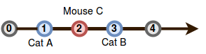

Dos gatos y un ratón están en varias posiciones en una línea. Se le darán sus posiciones iniciales. Tu tarea es determinar qué gato llegará primero al ratón, suponiendo que el ratón no se mueva y que los gatos viajen a la misma velocidad. Si los gatos llegan al mismo tiempo, el ratón podrá moverse y escapará mientras luchan.

te danconsultas en forma de, , yrepresentando las posiciones respectivas para los gatosy, y para ratón. Completa la funciónpara devolver la respuesta adecuada a cada consulta, que se imprimirá en una nueva línea.

si gatoatrapa el mouse primero, imprime Cat A.
si gatoatrapa el mouse primero, imprime Cat B.
Si ambos gatos alcanzan al ratón al mismo tiempo, imprima Mouse Cmientras los dos gatos pelean y el ratón escapa.
Ejemplo

Los gatos están en posiciones.(Gato A) y(Cat B), y el mouse está en la posición. Cat B, en la posiciónllegará primero ya que es sólounidad de distancia mientras que la otra estáunidades de distancia. Devuelve 'Gato B'.

Función descriptiva

Complete la función catAndMouse en el editor a continuación.

catAndMouse tiene los siguientes parámetros:

int x : gatoposición de
int y : gatoposición de
int z : Ratónposición de
Devoluciones

cadena: 'Gato A', 'Gato B' o 'Ratón C'
Formato de entrada

La primera línea contiene un solo entero,, que indica el número de consultas.
Cada una de laslas líneas subsiguientes contienen tres enteros separados por espacios que describen los valores respectivos de(gatoubicación de ),(gatola ubicación de ), y(ratónubicación).

Restricciones

Entrada de muestra 0

```

2
1 2 3
1 3 2

```

Salida de muestra 0

```
Gato B
Ratón C
Explicación 0
```

Consulta 0: Las posiciones de los gatos y el ratón se muestran a continuación:


Gatoatrapará el mouse primero, por lo que imprimiremos Cat Ben una nueva línea.

Consulta 1 : en esta consulta, los gatosyllegar al ratónexactamente al mismo tiempo:


Debido a que el mouse se escapa, imprimimos Mouse Cen una nueva línea.
